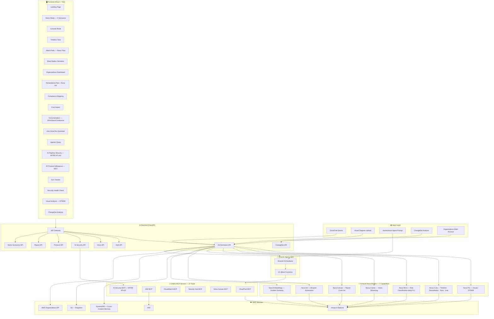
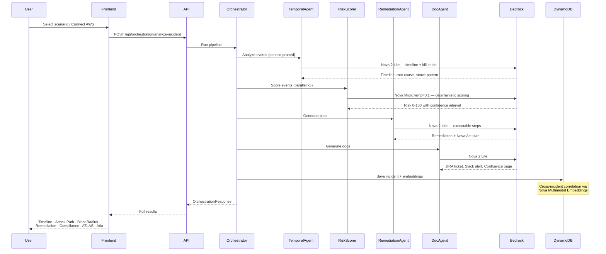

# 🛡 wolfir

**AI that secures your cloud — and secures itself. Powered by Amazon Nova.**

> The only cloud security platform that also watches itself. **7 Amazon Nova capabilities** detect, investigate, classify, remediate, and document cloud threats — while monitoring the AI pipeline against MITRE ATLAS in real time. Built for SOC analysts and AI security teams. **Cloud security + AI security, one platform.**

[](https://wolfir.vercel.app)

> **Note for judges:** The [live Vercel demo](https://wolfir.vercel.app) runs in **instant client-side simulation** mode when the backend is not reachable — no AWS setup needed. For the **full Nova AI pipeline** (5 agents, MITRE ATLAS, Agentic Query, real CloudTrail), run the backend locally: `cd backend && uvicorn main:app --reload`. All code is in this repo, including `backend/agents/strands_orchestrator.py`.

---

## Motivation

Security teams receive **960+ alerts per day** on average, and **40% go uninvestigated** (Prophet Security, AI in SOC Survey, 2025). Manual correlation, triage, and remediation take hours — often at 2am. Existing tools detect; they don't respond. We built wolfir to close that gap: from alert to remediation plan to documentation, autonomously, with human-in-the-loop approval for risky actions.

But there was a second problem nobody was solving: every modern security platform now uses AI, but nobody is securing the AI itself. Prompt injection, API abuse, adversarial inputs — MITRE ATLAS has catalogued these threats. Who's monitoring them in production? For most teams, the answer is nobody. wolfir does.

**Why we chose this path:**
- **Multi-model specialization** — One model can't do everything well. Nova Pro reads diagrams. Nova Micro scores risk in <1s. Nova 2 Lite reasons over timelines. Each does what it's best at.
- **Agentic over static** — We wanted an AI that picks its own tools (CloudTrail, IAM, Security Hub) and plans its own queries, not a fixed workflow.
- **Action, not just insight** — Remediation plans with one-click apply, CloudTrail proof, and rollback. Nova Act for AWS Console and JIRA automation.
- **Who protects the AI?** — MITRE ATLAS monitoring on our own pipeline. Prompt injection, API abuse, data exfiltration — we watch ourselves.

## Why "wolfir"?

**wolf** + **ir** (Incident Response). A wolf hunts in a pack — coordinated, precise, relentless. Our multi-agent pipeline works the same way: 7 Nova capabilities, each with a role, sharing state, moving from signal to resolution. The name is short, memorable, and signals both the "hunt" (finding threats) and the "pack" (multi-agent orchestration).

## What is wolfir?

wolfir is an **autonomous security platform** that closes two gaps:

1. **Cloud security** — Incident response: detect, investigate, classify, remediate, document. CloudTrail → timeline → attack path → remediation with one-click apply. Built with Amazon Nova Pro, Nova 2 Lite, Nova Micro, Nova 2 Sonic, Nova Canvas, Nova Act, and Nova Multimodal Embeddings.

2. **AI security** — "Who protects the AI?" wolfir monitors its own Bedrock pipeline with MITRE ATLAS (6 techniques), OWASP LLM Top 10, Shadow AI detection, and EU AI Act / NIST AI RMF compliance readiness. When you use AI to defend your cloud, we defend the AI.

**AI systems run on cloud. When cloud is compromised, AI is compromised. wolfir secures both.** This is not a dashboard or SIEM — it's an autonomous multi-agent system that takes action and watches itself.

---

## ✨ Features at a Glance

| Feature | Description |
|---------|-------------|
| **5-Agent Nova Pipeline** | Detect → Investigate → Classify → Remediate → Document (Nova Pro, Nova 2 Lite, Nova Micro) |
| **Attack Path Diagram** | Interactive React Flow diagram tracing threat propagation across AWS resources |
| **Blast Radius Simulator** | Proactive "what-if" — given a compromised identity, maps every reachable resource, service, and data store an attacker could access |
| **AWS Organizations Dashboard** | Multi-account security view: org tree (Management → OUs → Member Accounts), cross-account threat correlation, SCP gap analysis |
| **Compliance Mapping** | CIS, NIST 800-53, SOC 2, PCI-DSS, SOX, HIPAA — auto-mapped from incident context |
| **Cost Impact** | Financial exposure using IBM Cost of Data Breach formula, breach liability, ROI estimation |
| **Remediation + Nova Act** | AI-generated plans with one-click apply, JIRA automation, before/after state snapshots, rollback |
| **Aria** | Voice/text assistant for incident Q&A — powered by Nova 2 Sonic and Nova 2 Lite |
| **Agentic Query** | Autonomous agent picks tools from 6 AWS MCP servers (27 tools) — no fixed workflow |
| **Security Health Check** | 5 autonomous agent queries with no incident required — proactive posture assessment |
| **ChangeSet Analysis** | CloudFormation ChangeSet risk assessment before deployment |
| **IR Protocol Adherence** | NIST IR phase compliance scoring with gap identification |
| **SLA Tracker** | Incident SLA monitoring with breach prediction |
| **AI Pipeline Security** | MITRE ATLAS monitoring (6 techniques), OWASP LLM Top 10, Shadow AI detection |
| **Visual Analysis** | Upload architecture diagrams — Nova Pro performs STRIDE threat assessment |
| **Cross-Incident Memory** | DynamoDB + Nova Embeddings: detects attack campaigns across incidents |
| **Real AWS** | Connect via AWS CLI profile — credentials stay local, never transmitted |
| **Demo Scenarios** | 5 pre-computed scenarios: IAM Privilege Escalation, Cryptocurrency Mining, S3 Data Exfiltration, Unauthorized Access, Shadow AI + Organizations Breach |

---

## 🏗 Architecture

### High-Level Flow

```
CloudTrail Alert / Real AWS / Demo Scenario
              ↓
┌─────────────────────────────────────────────────────┐
│       STRANDS AGENTS SDK — Orchestration Layer       │
├──────────┬──────────┬──────────┬────────┬───────────┤
│  Nova    │  Nova 2  │  Nova    │ Nova 2 │  Nova     │
│  Pro     │  Lite    │  Micro   │  Lite  │  2 Lite   │
│ Detect   │Investigate│ Classify│Remediate│ Document  │
├──────────┴──────────┴──────────┴────────┴───────────┤
│  6 MCP Servers · 27 MCP Tools · 21 Strands @tools   │
│  CloudTrail · IAM · CloudWatch · Security Hub ·     │
│  Nova Canvas · AI Security                          │
├─────────────────────────────────────────────────────┤
│  Nova Act (Browser Automation) · Nova Canvas (Art)  │
│  Nova 2 Sonic (Voice) · Nova Embeddings (Similarity)│
└─────────────────────────────────────────────────────┘
              ↓              ↓              ↓
          DynamoDB      CloudTrail     JIRA / Slack /
         (Memory)      (Audit Proof)   Confluence
```

### Detailed Architecture Diagram



### Data Flow (Incident Analysis)



### Scalability Architecture (Production Path)

```
                    ┌────────────────────────────┐
                    │  CloudTrail / GuardDuty     │
                    │  (960+ alerts/day avg)      │
                    └─────────────┬──────────────┘
                                  │
                    ┌─────────────▼──────────────┐
                    │   AWS SQS (Alert Queue)    │
                    │   FIFO · DLQ · 14-day TTL  │
                    └──┬───────────┬──────────┬──┘
                       │           │           │
          ┌────────────▼──┐ ┌──────▼──────┐ ┌─▼────────────┐
          │ wolfir Worker  │ │wolfir Worker│ │wolfir Worker  │
          │  (ECS Fargate) │ │(ECS Fargate)│ │(ECS Fargate)  │
          │ Priority: HIGH │ │Priority: MED│ │Priority: LOW  │
          └──────┬─────────┘ └──────┬──────┘ └──────┬────────┘
                 │                  │                │
          ┌──────▼──────────────────▼────────────────▼───────┐
          │       Strands Agents Orchestration Layer          │
          │  Nova Pro · Nova 2 Lite · Nova Micro · Nova Act   │
          │         6 MCP Servers · 27 MCP Tools              │
          └────────────────────────┬──────────────────────────┘
                                   │
          ┌────────────────────────▼──────────────────────────┐
          │            DynamoDB Global Tables                  │
          │   Cross-region incident memory & correlation       │
          │   us-east-1 · us-west-2 · ap-southeast-1          │
          └────────────────────────────────────────────────────┘
```

---

## 🔑 Key Differentiators

### 1. AI Security Self-Monitoring (MITRE ATLAS)
wolfir monitors its **own** Bedrock AI pipeline against 6 MITRE ATLAS techniques in real time. No other security platform watches its own AI pipeline. This is the second pillar — not an add-on.

### 2. Blast Radius Simulator
Given any compromised IAM identity from an incident, wolfir maps every AWS service, resource, and data store the attacker could reach using IAM policy simulation. Shows critical/high/medium/low risk zones with estimated financial impact per resource.

### 3. AWS Organizations Multi-Account View
Full org tree visualization (Management Account → OUs → Member Accounts), cross-account lateral movement detection, SCP gap analysis, and account-level security posture scores — all from a single wolfir console.

### 4. Cross-Incident Memory (DynamoDB + Nova Embeddings)
Persistent behavioral correlation across incidents. Run two demos — the second detects "78% probability same attacker." Embeddings over structured feature vectors (not prose) give accurate behavioral matching.

### 5. Autonomous Remediation with Proof
Executes AWS API calls (not just plans). Before/after state snapshots, CloudTrail confirmation of every action, one-click rollback.

---

## 🤖 Nova Models & Services Used — 7 Capabilities

wolfir uses **7 Amazon Nova capabilities** — each chosen for what it does best:

| # | Model / Service | Model ID | Usage |
|---|-----------------|----------|-------|
| 1 | **Nova Pro** | `amazon.nova-pro-v1:0` | Visual architecture analysis — multimodal, STRIDE threat modeling on uploaded diagrams |
| 2 | **Nova 2 Lite** | `us.amazon.nova-2-lite-v1:0` | Timeline reconstruction, remediation generation, documentation, Aria assistant, Strands orchestrator |
| 3 | **Nova Micro** | `amazon.nova-micro-v1:0` | Risk scoring at `temp=0.1` — deterministic, runs 3× in parallel for confidence interval |
| 4 | **Nova 2 Sonic** | `amazon.nova-2-sonic-v1:0` | Aria voice — WebSocket streaming speech-to-text and TTS |
| 5 | **Nova Canvas** | `amazon.nova-canvas-v1:0` | Incident report cover art — context-aware image per incident type |
| 6 | **Nova Act** | nova-act SDK | Browser automation plans — AWS Console remediation steps, JIRA ticket creation |
| 7 | **Nova Multimodal Embeddings** | `amazon.nova-2-multimodal-embeddings-v1:0` | Cross-incident behavioral similarity search |

**Why this mix?** Each model has a strength. Nova Micro scores risk in <1s at near-zero temperature. Nova 2 Lite handles all heavy text reasoning. Nova Pro reads images — text models can't do STRIDE on architecture diagrams. Nova Canvas generates visuals. Nova Act automates browser workflows. Embeddings power "find similar incidents." One model doing all of this would be slower, less accurate, and context-bound.

---

## 🔧 AWS Services

- **Amazon Bedrock** — All Nova model invocations
- **DynamoDB** — Cross-incident memory, correlation, incident history
- **CloudTrail** — Security event source + audit proof for every remediation
- **IAM** — Policy analysis, Blast Radius simulation, remediation execution
- **CloudWatch** — Anomaly detection, billing anomaly monitoring
- **S3** — Architecture diagram storage
- **AWS Organizations** — Multi-account org tree, SCP analysis
- **Strands Agents SDK** — Multi-agent orchestration framework

---

## 📦 Tech Stack

- **Backend**: Python, FastAPI, Strands Agents SDK, boto3
- **Frontend**: React, TypeScript, Vite, Tailwind CSS, Framer Motion, React Flow
- **MCP**: FastMCP — 6 AWS MCP servers (CloudTrail, IAM, CloudWatch, Security Hub, Nova Canvas, AI Security), 27 MCP tools, 21 Strands `@tool` functions
- **Deployment**: Vercel (frontend), Local/EC2/Docker (backend)

---

## 🚀 Quick Start

### Prerequisites
- Python 3.11+
- Node.js 18+
- AWS credentials configured (`aws configure`)

### IAM Permissions

| Service | Actions | Purpose |
|---------|---------|---------|
| **CloudTrail** | `LookupEvents`, `ListTrails` | Real AWS analysis |
| **Bedrock** | `InvokeModel`, `ListFoundationModels` | Nova AI pipeline |
| **DynamoDB** | `PutItem`, `GetItem`, `Query`, `DescribeTable`, `CreateTable` | Cross-incident memory |
| **Organizations** | `ListAccounts`, `ListOrganizationalUnitsForParent`, `DescribeOrganization` | Multi-account dashboard |

See **[docs/IAM-POLICY-CLOUDTRAIL.md](docs/IAM-POLICY-CLOUDTRAIL.md)** for exact JSON policies and step-by-step setup.

### Backend
```bash
cd backend
pip install -r requirements.txt
uvicorn main:app --reload --host 0.0.0.0 --port 8000
# API runs on http://localhost:8000
```

### Frontend
```bash
cd frontend
npm install
npm run dev
# App runs on http://localhost:5173
```

### Optional: Knowledge Base (RAG) for Enhanced Playbooks

wolfir works without a Knowledge Base. For enhanced playbook retrieval and semantic incident search in Agentic Query, optionally deploy:

1. **Terraform** — Creates S3 bucket and uploads sample playbooks:
   ```bash
   cd terraform && terraform init && terraform apply
   ```
2. **Bedrock Console** — Create a Knowledge Base with **S3 Vectors** (Quick create), connect to the Terraform-created bucket, sync.
3. **Configure** — Set `KNOWLEDGE_BASE_ID` in `.env`.

See [terraform/README.md](terraform/README.md) for step-by-step instructions.

---

## 🎬 Demo Flow (No AWS Required)

1. Open http://localhost:5173 (or https://wolfir.vercel.app)
2. Click **Launch Console** → **Scenario Picker**
3. Select a scenario — "Cryptocurrency Mining" or "IAM Privilege Escalation"
4. Watch the 5-agent pipeline execute with model labels in real time
5. Explore every tab:
   - **Timeline** → forensic kill chain reconstruction
   - **Attack Path** → interactive React Flow diagram, click nodes
   - **Blast Radius** → what the attacker could reach from this identity
   - **Compliance** → CIS, NIST 800-53, SOC 2, PCI-DSS, SOX, HIPAA
   - **Cost Impact** → financial exposure with IBM formula
   - **Remediation** → click **Generate Nova Act Plan** for browser automation steps
   - **IR Protocol** → NIST IR phase scoring
   - **AI Security** → MITRE ATLAS posture (wolfir watching itself)
   - **SLA Tracker** → incident response SLA status
6. **Cross-incident correlation**: run scenario 1, then run scenario 2 — see "78% same attacker"
7. **Agentic Query** → ask anything: "What IAM permissions were abused?", "Which controls failed?"
8. **Aria** → voice/text assistant: "What is the root cause?" "Have we seen this attacker before?"
9. **Organizations Dashboard** → multi-account org tree, cross-account threats, SCP gaps
10. **Export** → PDF report with Nova Canvas cover art

### Real AWS Analysis
1. Configure credentials: `aws configure --profile wolfir` (see [docs/AWS_SETUP.md](docs/AWS_SETUP.md))
2. Start backend and frontend
3. **Real AWS Account** tab → **Test AWS Connection** → **Analyze Real CloudTrail Events**

---

## 📊 Performance

| Metric | Value |
|--------|-------|
| Demo mode latency | ~2 seconds (pre-computed real Nova outputs) |
| Full pipeline (real AWS) | 30–45 seconds end-to-end |
| Cost per incident | ~$0.013 *(see derivation below)* |
| MITRE ATT&CK Coverage | T1078, T1098, T1059, T1496, T1530 |
| MITRE ATLAS Monitoring | 6 techniques |
| Compliance Frameworks | CIS, NIST 800-53, SOC 2, PCI-DSS, SOX, HIPAA |

**Cost derivation:** Typical incident — 5 Nova calls (Detect, Investigate, Classify, Remediate, Document). Nova 2 Lite: ~4K tokens in, ~1K out ≈ $0.001/call. Nova Micro ≈ $0.0002/call. Total ≈ $0.005–0.015 on Bedrock on-demand (US East). See [BILLING_AND_OPEN_SOURCE.md](BILLING_AND_OPEN_SOURCE.md) for full details.

---

## 🔒 Security of the Product

- **Credentials** — Never stored, always local via AWS CLI profile. Explicit `del credentials` immediately after `sts.get_caller_identity()` validation. No long-lived keys in wolfir.
- **Demo mode** — Complete client-side fallback; no AWS connection required. Demo outputs are real Nova model outputs, not fabricated.
- **CloudTrail audit proof** — Every remediation action is logged and verifiable.
- **Rate limiting** — 60 requests/minute per IP (SlowAPI).
- **Input sanitization** — 500-event cap, 5MB request body max, JSON validated before processing.
- **Agentic Query guardrails** — MITRE ATLAS AML.T0051 monitoring + Bedrock Guardrails protect against prompt injection. Status visible in UI — not decoration.
- **Blast Radius** — Read-only IAM simulation; no destructive calls. Simulates policy evaluation without executing actions.

---

## 💰 AWS Billing & Open Source

**Important**: This project uses your AWS account and credentials. All AWS charges are billed to your account.

- Each user configures their own AWS credentials
- Estimated cost: ~$2–5/month for light usage
- See [BILLING_AND_OPEN_SOURCE.md](BILLING_AND_OPEN_SOURCE.md) for details

---

## 🧪 Testing

```bash
cd backend
pip install -r requirements.txt
pytest tests/ -v
```

---

## 📝 Blog Posts

Technical deep-dives on wolfir's design and architecture decisions:

- [01 — wolfir Project Overview: Why Seven Nova Capabilities](blogs/01-wolfir-project-overview.md)
- [02 — Multi-Agent Orchestration: The Problems Nobody Warned About](blogs/02-multi-agent-orchestration-challenges.md)
- [03 — AI Pipeline Security & MITRE ATLAS](blogs/03-ai-pipeline-security-mitre-atlas.md)
- [04 — Real AWS vs. Demo Mode: Building Two-Mode Parity](blogs/04-real-aws-vs-demo-mode.md)
- [05 — Remediation, Nova Act & Human-in-the-Loop](blogs/05-remediation-nova-act-and-human-in-the-loop.md)

---

**#AmazonNova** | **#wolfir** | **#AIforSecurity**
