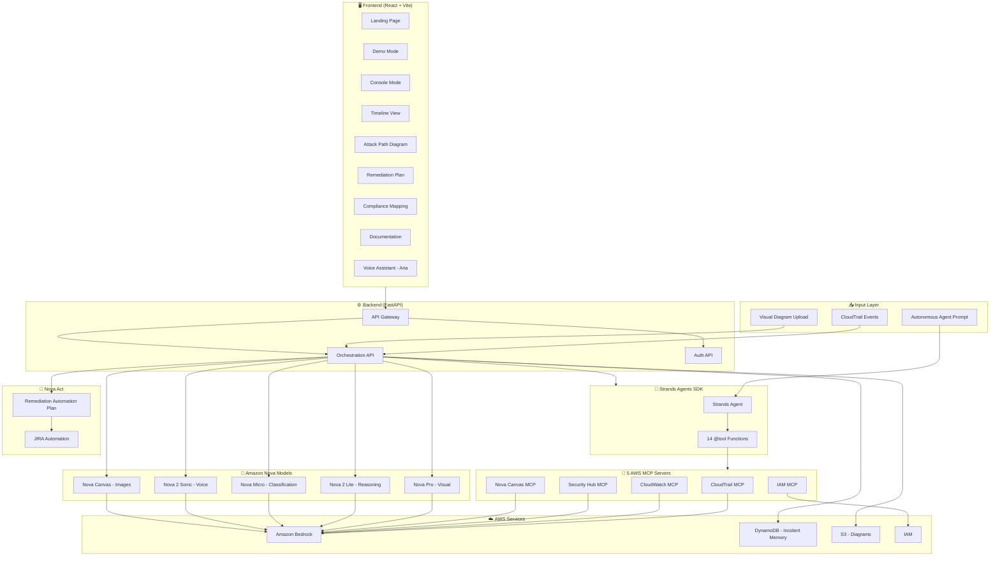
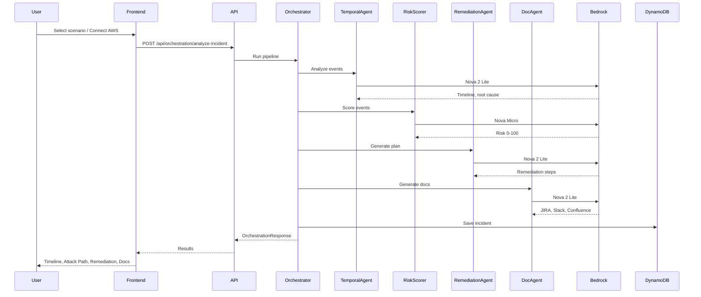

# 🛡 Nova Sentinel

**Autonomous Security Incident Response Powered by Amazon Nova**

> Built for **SOC analysts, cloud security engineers, and incident responders** — including teams using AWS IAM Identity Center (SSO). 11,000+ alerts/day, &lt;5% investigated. Nova Sentinel closes the gap — from alert to resolution, autonomously. **5 Amazon Nova models + Nova Act** working together like a real security team.

[](https://nova-sentinel.vercel.app)

---

## Why We Built This

We've seen security teams drown in alerts. Manual correlation, triage, and remediation take hours at 2am. Existing tools detect — they don't respond. Nova Sentinel is an experiment in what happens when you apply Amazon Nova's full multimodal, multi-model capability to close that gap: from alert to remediation plan to documentation, autonomously, with human-in-the-loop approval for risky actions.

## What is Nova Sentinel?

Nova Sentinel is an **agentic incident response pipeline** that autonomously detects, investigates, classifies, remediates, and documents cloud security threats. **This is built with 5 Amazon Nova models** (Nova Pro, Nova 2 Lite, Nova Micro, Nova 2 Sonic, Nova Canvas) in coordinated orchestration, plus **Nova Act** for browser automation. Each model is chosen for what it does best.

**This is not a dashboard or SIEM. It's an autonomous multi-agent system that takes action.**

## 🏗 Architecture

### High-Level Flow

```
CloudTrail Alert
      ↓
┌─────────────────────────────────────────────────┐
│  STRANDS AGENTS SDK — Orchestration Layer        │
├─────────┬──────────┬──────────┬────────┬────────┤
│  Nova   │  Nova 2  │  Nova    │ Orch-  │ Nova 2 │
│  Pro    │  Lite    │  Micro   │ estrator│ Lite   │
│ Detect  │Investigate│ Classify │Remediate│Document│
├─────────┴──────────┴──────────┴────────┴────────┤
│  5 MCP Servers (CloudTrail, IAM, CW, Security Hub, Canvas) │
│  23 MCP Tools · 14 Strands @tool Functions · Nova Act      │
└──────────────────────────────────────────────────┘
      ↓              ↓             ↓
  DynamoDB     CloudTrail      JIRA/Slack/
  (Memory)     (Audit Proof)   Confluence
```

### Detailed Architecture Diagram



### Data Flow (Incident Analysis)



## 🔑 Key Differentiators

### 1. Cross-Incident Memory (DynamoDB)
Persistent correlation engine detects attack campaigns across incidents. Run two demos — the second one says "78% probability this is the same attacker."

### 2. Autonomous Remediation with Proof
Actually executes AWS API calls (not just plans). Before/after state snapshots, CloudTrail confirmation, one-click rollback.

### 3. AI Pipeline Self-Monitoring (MITRE ATLAS)
"Who protects the AI?" Monitors its own Bedrock pipeline for prompt injection, API abuse, and data exfiltration using 6 MITRE ATLAS techniques.

## 🤖 Nova Models & Services Used

| Model / Service | Role | Why This Model |
|-----------------|------|----------------|
| **Nova Pro** | Visual architecture analysis | Multimodal — reads diagram images |
| **Nova 2 Lite** | Temporal analysis, remediation, docs | Fast, accurate text reasoning |
| **Nova Micro** | Risk classification (0-100) | Ultra-fast, deterministic (temp=0.1) |
| **Nova 2 Sonic** | Voice (Aria) | Integration-ready; requires WebSocket streaming. Aria uses Nova 2 Lite + browser TTS today. |
| **Nova Canvas** | Report cover art generation | Image generation |
| **Nova Act** | Browser automation for remediation & JIRA | AWS Console navigation, JIRA ticket creation — plan mode in UI, live mode with SDK |
| **Nova Multimodal Embeddings** | Semantic similarity for incidents | "Find similar incidents" in Incident History — cosine similarity over incident summaries |

## 🔧 AWS Services

- **Amazon Bedrock** — All Nova model invocations
- **DynamoDB** — Cross-incident memory + correlation
- **CloudTrail** — Security event source + audit proof
- **IAM** — Policy analysis + remediation execution
- **CloudWatch** — Anomaly detection + billing monitoring
- **S3** — Architecture diagram storage
- **Strands Agents SDK** — Multi-agent orchestration

## 📦 Tech Stack

- **Backend**: Python, FastAPI, Strands Agents SDK, boto3
- **Frontend**: React, TypeScript, Vite, Tailwind CSS, Framer Motion
- **MCP**: FastMCP with 5 AWS MCP servers (CloudTrail, IAM, CloudWatch, Security Hub, Nova Canvas). 14 Strands @tool functions.
- **Deployment**: Vercel (frontend), Local/EC2 (backend)

## 🚀 Quick Start / Setup

### Prerequisites
- Python 3.11+
- Node.js 18+
- AWS credentials configured (`aws configure`)

### IAM Permissions

The IAM user (e.g. `secops-lens-pro`) used for AWS credentials needs these permissions:

| Service | Actions | Purpose |
|---------|---------|---------|
| **CloudTrail** | `LookupEvents`, `ListTrails` | Real AWS analysis |
| **Bedrock** | `InvokeModel`, `ListFoundationModels` | Nova AI pipeline |
| **DynamoDB** | `PutItem`, `GetItem`, `Query`, `DescribeTable`, `CreateTable` | Cross-Incident Memory |

**If you see** `AccessDeniedException` for `dynamodb:PutItem`, `dynamodb:Query`, or `dynamodb:DescribeTable`, add the DynamoDB policy — see **[docs/IAM-POLICY-CLOUDTRAIL.md](docs/IAM-POLICY-CLOUDTRAIL.md)** for exact JSON and step-by-step instructions.

### Backend
```bash
cd backend
pip install -r requirements.txt
python main.py
# API runs on http://localhost:8000
```

Or with hot-reload:
```bash
cd backend
uvicorn main:app --reload --host 0.0.0.0 --port 8000
```

### Frontend
```bash
cd frontend
npm install
npm run dev
# App runs on http://localhost:5173
```

### Demo Flow
1. Open http://localhost:5173
2. Click **Launch Console** or **Try Demo**
3. In Demo mode: select a scenario (e.g. Cryptocurrency Mining, IAM Privilege Escalation)
4. Watch the 5-agent pipeline execute in real time
5. Navigate: Security Overview → Incident Timeline → Attack Path → Compliance → Cost Impact → Remediation → AI Pipeline Security
6. Ask **Aria** (voice assistant): "What is the root cause?" or "Have we seen this attack before?"
7. Export reports (PDF, clipboard, print)

## 📊 Performance

| Metric | Value |
|--------|-------|
| Alert to Resolution | End-to-End Automated |
| Cost per Incident | $0.013 |
| MITRE ATT&CK Coverage | T1078, T1098, T1059, T1496, T1530 |
| MITRE ATLAS Monitoring | 6 techniques |
| Compliance Frameworks | CIS, NIST 800-53, SOC 2, PCI-DSS, SOX, HIPAA |

## 💰 AWS Billing & Open Source

**Important**: This project uses **your AWS account and credentials**. All AWS charges will be billed to **your account**.

- Each user configures their own AWS credentials
- Estimated cost: ~$2-5/month for light usage
- See [BILLING_AND_OPEN_SOURCE.md](BILLING_AND_OPEN_SOURCE.md) for details

## 📄 License

AI-powered security intelligence built with Amazon Nova.

---

**#AmazonNova** | **#Nova Sentinel** | **#AIforSecurity**
