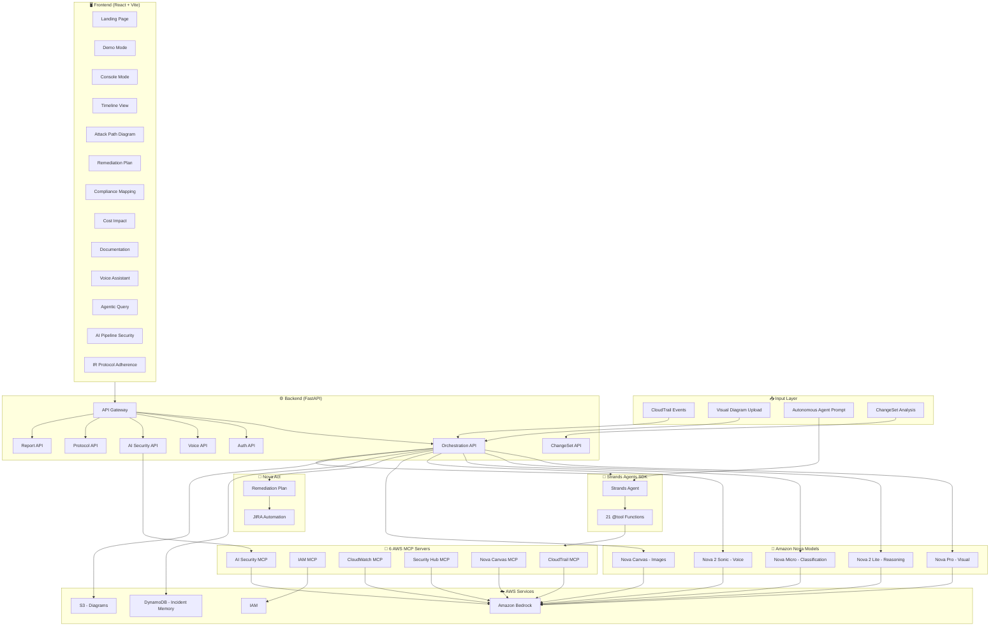
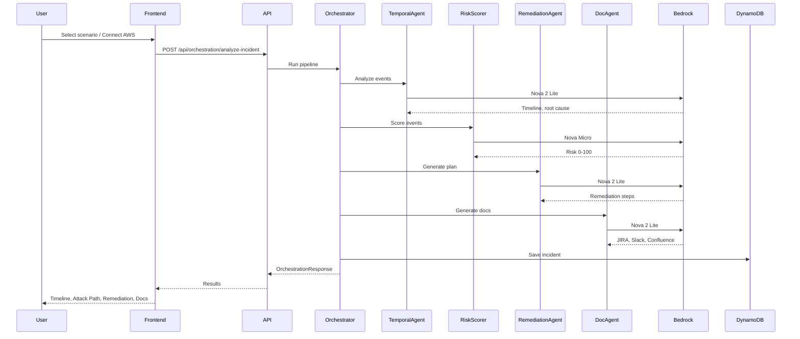

# 🛡 wolfir

**AI that secures your cloud — and secures itself. Powered by Amazon Nova.**

> The only cloud security platform that also watches itself. **5 Amazon Nova models** detect, investigate, classify, remediate, and document cloud threats — while monitoring the AI pipeline against MITRE ATLAS in real time. Built for SOC analysts and AI security teams. **Cloud + AI security, one platform.**

[](https://wolfir.vercel.app)

> **Note for judges:** The [live Vercel demo](https://wolfir.vercel.app) runs in **instant client-side simulation** mode when the backend is not reachable — no AWS setup needed. For the **full Nova AI pipeline** (5 agents, MITRE ATLAS, Agentic Query, real CloudTrail), run the backend locally: `cd backend && uvicorn main:app --reload`. All code is in this repo, including `backend/agents/strands_orchestrator.py`.

---

## Motivation

Security teams receive **11,000+ alerts per day** and investigate **less than 5%** (Ponemon Institute, *Cost of Data Breach Report*). Manual correlation, triage, and remediation take hours — often at 2am. Existing tools detect; they don't respond. We built wolfir to close that gap: from alert to remediation plan to documentation, autonomously, with human-in-the-loop approval for risky actions.

**Why we chose this path:**
- **Multi-model specialization** — One model can't do everything well. Nova Pro reads diagrams. Nova Micro scores risk in &lt;1s. Nova 2 Lite reasons over timelines. Each does what it's best at.
- **Agentic over static** — We wanted an AI that picks its own tools (CloudTrail, IAM, Security Hub) and plans its own queries, not a fixed workflow.
- **Action, not just insight** — Remediation plans with one-click apply, CloudTrail proof, and rollback. Nova Act for AWS Console and JIRA automation.
- **Who protects the AI?** — MITRE ATLAS monitoring on our own pipeline. Prompt injection, API abuse, data exfiltration — we watch ourselves.

## Why "wolfir"?

**wolf** + **ir** (Incident Response). A wolf hunts in a pack — coordinated, precise, relentless. Our multi-agent pipeline works the same way: 5 Nova models plus an autonomous agent, each with a role, sharing state, moving from signal to resolution. The name is short, memorable, and signals both the "hunt" (finding threats) and the "pack" (multi-agent orchestration).

## What is wolfir?

wolfir is an **autonomous security platform** that closes two gaps:

1. **Cloud security** — Incident response: detect, investigate, classify, remediate, document. CloudTrail → timeline → attack path → remediation with one-click apply. Built with 5 Amazon Nova models (Pro, 2 Lite, Micro, 2 Sonic, Canvas), Nova Act, and Nova Embeddings.

2. **AI security** — "Who protects the AI?" wolfir monitors its own Bedrock pipeline with MITRE ATLAS (6 techniques), OWASP LLM Top 10, Shadow AI detection. When you use AI to defend your cloud, we defend the AI.

**AI systems run on cloud. When cloud is compromised, AI is compromised. wolfir secures both.** This is not a dashboard or SIEM — it's an autonomous multi-agent system that takes action and watches itself.

## ✨ Features at a Glance

| Feature | Description |
|---------|-------------|
| **5-Agent Pipeline** | Detect → Investigate → Classify → Remediate → Document (Nova Pro, Nova 2 Lite, Nova Micro) |
| **Attack Path** | Interactive diagrams tracing threat propagation across AWS |
| **Compliance Mapping** | CIS, NIST 800-53, SOC 2, PCI-DSS, SOX, HIPAA |
| **Cost Impact** | Financial exposure, breach liability, ROI estimation |
| **Remediation + Nova Act** | AI-generated plans with one-click apply, JIRA automation |
| **Aria** | Voice/text assistant for incident Q&A |
| **Agentic Query** | Autonomous agent picks tools from 6 AWS MCP servers |
| **Security Health Check** | 5 agent queries with no incident required |
| **ChangeSet Analysis** | CloudFormation ChangeSet risk assessment |
| **IR Protocol Adherence** | NIST IR phase compliance scoring |
| **AI Pipeline Security** | MITRE ATLAS monitoring (6 techniques) |
| **Visual Analysis** | Upload diagrams — Nova Pro STRIDE assessment |
| **Real AWS** | Connect via CLI profile or SSO — credentials stay local |

## 🏗 Architecture

### High-Level Flow

```
CloudTrail Alert
      ↓
┌─────────────────────────────────────────────────┐
│  STRANDS AGENTS SDK — Orchestration Layer        │
├─────────┬──────────┬──────────┬────────┬────────┤
│  Nova   │  Nova 2  │  Nova    │ Orch-  │ Nova 2 │
│  Pro    │  Lite    │  Micro   │ estrator│ Lite   │
│ Detect  │Investigate│ Classify │Remediate│Document│
├─────────┴──────────┴──────────┴────────┴────────┤
│  6 MCP Servers (CloudTrail, IAM, CW, Security Hub, Canvas, AI Security) │
│  27 MCP Tools · 21 Strands @tool Functions · Nova Act       │
└──────────────────────────────────────────────────┘
      ↓              ↓             ↓
  DynamoDB     CloudTrail      JIRA/Slack/
  (Memory)     (Audit Proof)   Confluence
```

### Detailed Architecture Diagram



### Data Flow (Incident Analysis)



## 🔑 Key Differentiators

### 1. Cross-Incident Memory (DynamoDB)
Persistent correlation engine detects attack campaigns across incidents. Run two demos — the second one says "78% probability this is the same attacker."

### 2. Autonomous Remediation with Proof
Actually executes AWS API calls (not just plans). Before/after state snapshots, CloudTrail confirmation, one-click rollback.

### 3. AI Pipeline Self-Monitoring (MITRE ATLAS)
"Who protects the AI?" Monitors its own Bedrock pipeline for prompt injection, API abuse, and data exfiltration using 6 MITRE ATLAS techniques.

## 🤖 Nova Models & Services Used

wolfir uses **7 Amazon Nova capabilities** — each chosen for what it does best:

| # | Model / Service | Model ID | Usage |
|---|-----------------|----------|-------|
| 1 | **Nova Pro** | `amazon.nova-pro-v1:0` | Visual architecture analysis — multimodal, reads diagram images |
| 2 | **Nova 2 Lite** | `us.amazon.nova-2-lite-v1:0` | Timeline, remediation, docs, Aria, Strands Agent — fast text reasoning |
| 3 | **Nova Micro** | `amazon.nova-micro-v1:0` | Risk scoring — ultra-fast, deterministic (temp=0.1) |
| 4 | **Nova 2 Sonic** | `amazon.nova-2-sonic-v1:0` | Voice (integration-ready) — WebSocket streaming for Aria |
| 5 | **Nova Canvas** | `amazon.nova-canvas-v1:0` | Report cover art — image generation for incident reports |
| 6 | **Nova Act** | nova-act SDK | Browser automation plans — AWS Console remediation, JIRA ticket creation |
| 7 | **Nova Multimodal Embeddings** | `amazon.nova-2-multimodal-embeddings-v1:0` | Incident similarity — semantic search over incident history |

**Why this mix?** Each model has a strength. Nova Micro scores risk in &lt;1s. Nova 2 Lite handles the heavy reasoning. Nova Pro reads images. Nova Canvas generates visuals. Nova Act automates browser workflows. Embeddings power "find similar incidents." Throwing one model at everything would be slower and less accurate.

**Model roles:** Nova 2 Lite is the primary orchestrator for timeline, remediation, and documentation. Nova Pro handles visual diagram analysis. Nova Act is integrated in the Remediation tab — click "Generate Nova Act Plan" for AWS Console and JIRA browser automation steps.

## 🔧 AWS Services

- **Amazon Bedrock** — All Nova model invocations
- **DynamoDB** — Cross-incident memory + correlation
- **CloudTrail** — Security event source + audit proof
- **IAM** — Policy analysis + remediation execution
- **CloudWatch** — Anomaly detection + billing monitoring
- **S3** — Architecture diagram storage
- **Strands Agents SDK** — Multi-agent orchestration

## 📦 Tech Stack

- **Backend**: Python, FastAPI, Strands Agents SDK, boto3
- **Frontend**: React, TypeScript, Vite, Tailwind CSS, Framer Motion
- **MCP**: FastMCP with 6 AWS MCP servers (CloudTrail, IAM, CloudWatch, Security Hub, Nova Canvas, AI Security). 23 MCP tools. 21 Strands @tool functions.
- **Deployment**: Vercel (frontend), Local/EC2 (backend)

## 🚀 Quick Start / Setup

### Prerequisites
- Python 3.11+
- Node.js 18+
- AWS credentials configured (`aws configure`)

### IAM Permissions

The IAM user (e.g. `secops-lens-pro`) used for AWS credentials needs these permissions:

| Service | Actions | Purpose |
|---------|---------|---------|
| **CloudTrail** | `LookupEvents`, `ListTrails` | Real AWS analysis |
| **Bedrock** | `InvokeModel`, `ListFoundationModels` | Nova AI pipeline |
| **DynamoDB** | `PutItem`, `GetItem`, `Query`, `DescribeTable`, `CreateTable` | Cross-Incident Memory |

**If you see** `AccessDeniedException` for `dynamodb:PutItem`, `dynamodb:Query`, or `dynamodb:DescribeTable`, add the DynamoDB policy — see **[docs/IAM-POLICY-CLOUDTRAIL.md](docs/IAM-POLICY-CLOUDTRAIL.md)** for exact JSON and step-by-step instructions. See **[docs/AWS_SETUP.md](docs/AWS_SETUP.md)** for credential setup.

### Backend
```bash
cd backend
pip install -r requirements.txt
python main.py
# API runs on http://localhost:8000
```

**Ensure all backend files are committed** — including `backend/agents/strands_orchestrator.py`, `backend/mcp_servers/`, and `backend/agents/`. Judges cloning the repo need these for the full Nova AI pipeline.

Or with hot-reload:
```bash
cd backend
uvicorn main:app --reload --host 0.0.0.0 --port 8000
```

### Frontend
```bash
cd frontend
npm install
npm run dev
# App runs on http://localhost:5173
```

### Optional: Knowledge Base (RAG) for Enhanced Playbooks

wolfir works without a Knowledge Base — the Agent uses inline prompts when KB is not configured. For enhanced incident response playbook retrieval (RAG) and semantic "find similar incidents" in Agentic Query, optionally deploy:

1. **Terraform** — Creates S3 bucket and uploads sample playbooks:
   ```bash
   cd terraform && terraform init && terraform apply
   ```
2. **Bedrock Console** — Create a Knowledge Base with **S3 Vectors** (Quick create), connect to the Terraform-created bucket, sync.
3. **Configure** — Set `KNOWLEDGE_BASE_ID` in `.env`.

See [terraform/README.md](terraform/README.md) for step-by-step instructions. This step is optional; the Agent will use inline prompts when KB is not configured.

### Demo Flow (No AWS Required)
1. Open http://localhost:5173
2. Click **Launch Console** or **Try Demo**
3. Select a scenario (e.g. Cryptocurrency Mining, IAM Privilege Escalation)
4. Watch the 5-agent pipeline execute in real time
5. Explore: Timeline → Attack Path → Remediation → IR Protocol (NIST) → AI Security → Aria → Export
6. In Remediation: click **Generate Nova Act Plan** for AWS Console / JIRA browser automation
7. Ask **Aria**: "What is the root cause?" or "Have we seen this attack before?"
8. Export reports (PDF, clipboard, print)

### Real AWS Analysis
1. Configure AWS credentials: `aws configure --profile wolfir` (see [docs/AWS_SETUP.md](docs/AWS_SETUP.md))
2. Start backend and frontend
3. Go to **Real AWS Account** tab → **Test AWS Connection**
4. Click **Analyze Real CloudTrail Events** for live analysis

## 📊 Performance

| Metric | Value |
|--------|-------|
| Alert to Resolution | End-to-End Automated |
| Cost per Incident | ~$0.013 *(see derivation below)* |
| MITRE ATT&CK Coverage | T1078, T1098, T1059, T1496, T1530 |
| MITRE ATLAS Monitoring | 6 techniques |
| Compliance Frameworks | CIS, NIST 800-53, SOC 2, PCI-DSS, SOX, HIPAA |

**Cost per incident derivation:** Typical incident uses ~5 Nova calls (Detect, Investigate, Classify, Remediate, Document). Nova 2 Lite input ~4K tokens, output ~1K tokens ≈ $0.001/call; Nova Micro ~$0.0002/call. Total ≈ $0.005–0.015 depending on event volume. Assumes Bedrock on-demand pricing (US East). See [BILLING_AND_OPEN_SOURCE.md](BILLING_AND_OPEN_SOURCE.md) for details.

## 🔒 Security of the Product

- **Credentials** — Never stored; always local (CLI profile or SSO). Quick Connect accepts temporary keys for 30s validation only.
- **Demo mode** — Complete client-side fallback when backend is offline; no AWS required.
- **CloudTrail audit proof** — Every remediation action is logged and verifiable.
- **API rate limiting** — 60 requests/minute per IP (SlowAPI) to prevent abuse.
- **Input sanitization** — Orchestration API caps events at 500; request body max 5MB. JSON validated before processing.
- **Agentic Query guardrails** — MITRE ATLAS + Bedrock Guardrails protect against prompt injection and dangerous tool calls (e.g. `iam:DeleteUser`). Status visible in UI.

## 💰 AWS Billing & Open Source

**Important**: This project uses **your AWS account and credentials**. All AWS charges will be billed to **your account**.

- Each user configures their own AWS credentials
- Estimated cost: ~$2-5/month for light usage
- See [BILLING_AND_OPEN_SOURCE.md](BILLING_AND_OPEN_SOURCE.md) for details

## 🧪 Testing

```bash
cd backend
pip install -r requirements.txt
pytest tests/ -v
```

See [tests/README.md](tests/README.md) for test structure.

## 📝 Blog Posts

Natural-language deep dives on wolfir’s design and challenges:

- [01 — wolfir Project Overview](blogs/01-wolfir-project-overview.md)
- [02 — Multi-Agent Orchestration Challenges](blogs/02-multi-agent-orchestration-challenges.md)
- [03 — AI Pipeline Security & MITRE ATLAS](blogs/03-ai-pipeline-security-mitre-atlas.md)
- [04 — Real AWS vs. Demo Mode](blogs/04-real-aws-vs-demo-mode.md)
- [05 — Remediation, Nova Act & Human-in-the-Loop](blogs/05-remediation-nova-act-and-human-in-the-loop.md)

## 📄 License

AI-powered security intelligence built with Amazon Nova.

---

**#AmazonNova** | **#wolfir** | **#AIforSecurity**
